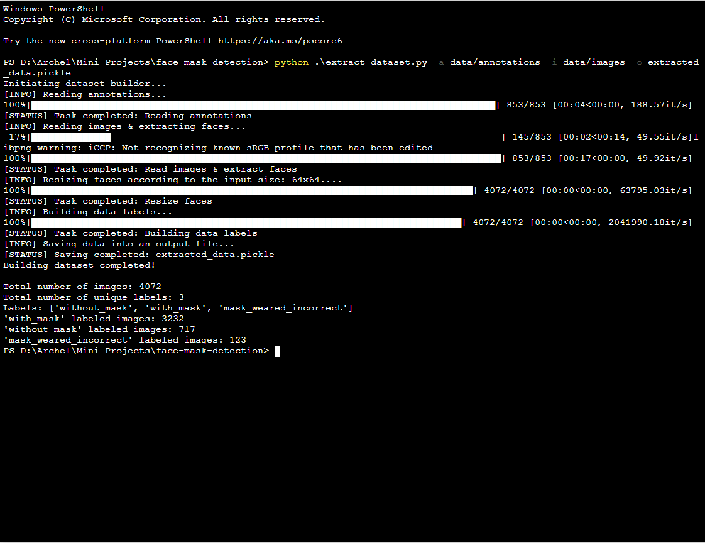
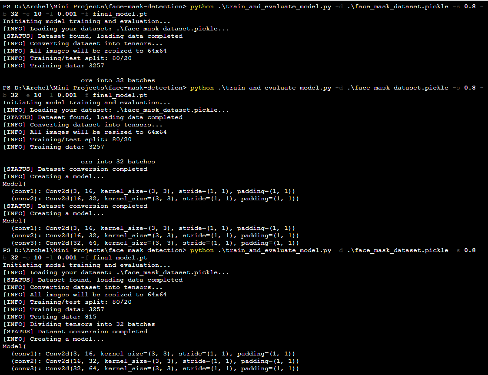
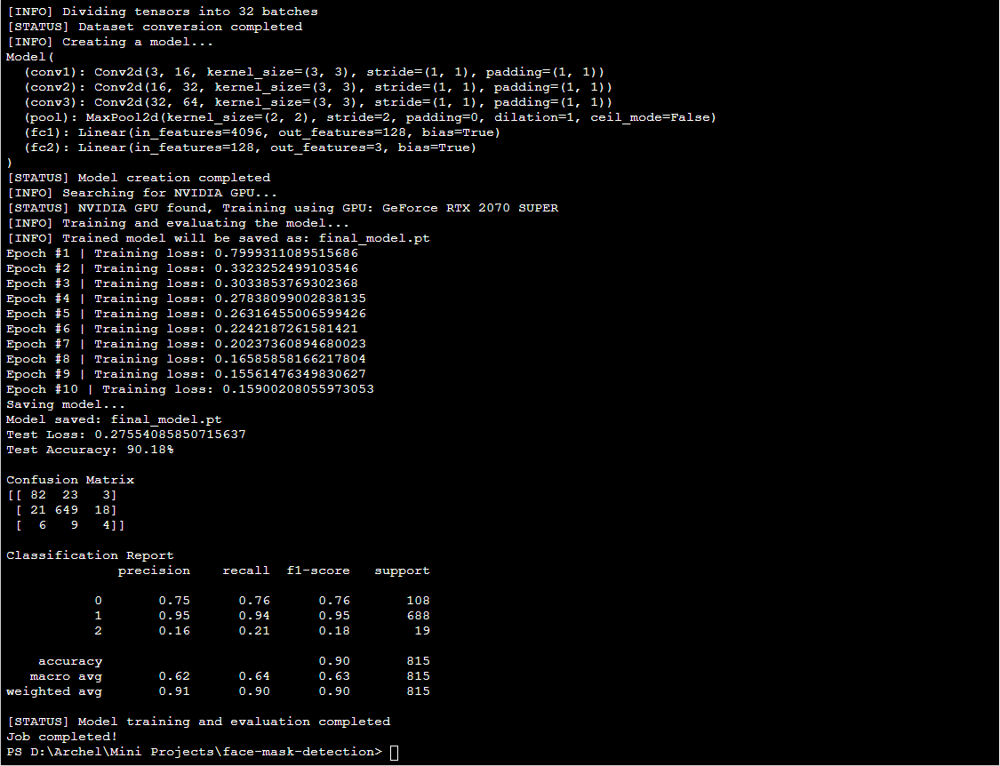

# Face Mask Detection

## I. Prerequisites
1. Download Anaconda from the official [website](https://www.anaconda.com/products/individual). You can also use `pip` package installer, but I recommend you to use Anaconda for its ability to create isolated environments which can contain different versions of Python or packages installed across different environments. If you already have Anaconda installed, you can skip to the next step.

2. Clone/download the zipped file of this repository into your local directory.

3. Open Anaconda Prompt, change the directory to `/envs`, then create an environment from one of the `.yml` files. <b>To decide which to create, you need to find out whether your machine has an NVIDIA GPU series (along with the CUDA version) or not.</b> If you own one, you should pick the `face_mask_detection_env.yml`. If you don't, then pick the `face_mask_detection_cpu_env.yml`
<b>Make sure you are located in the `/envs` directory</b>. To create the environment:
```
conda env create -f face_mask_detection_env.yml
```
or
```
conda env create -f face_mask_detection_cpu_env.yml
```

4. Activate the environment you just created:
```
conda activate face_mask_detection_env
```
or
```
conda activate face_mask_detection_cpu_env
```

5. Next, we still have to install PyTorch. PyTorch is one of the open source machine learning libraries for deep learning like Tensorflow, Caffe, etc. 
If create the `face_mask_detection_env.yml` environment, head to the PyTorch's official [website](https://pytorch.org/), then scroll down to the "Install PyTorch" section, choose your build, OS, package, language, and CUDA version, and you will find the command on how to install PyTorch with CUDA.<br>
If you create the environment using `face_mask_detection_cpu_env.yml`, skip this step because PyTorch CPU has been installed when you create the environment.

6. Follow this [link](https://drive.google.com/drive/folders/1uBNCtr45XHmpvQ3ei9--nOSnRXchEkgt?usp=sharing) to download the dataset and save it to `/data` directory. If you want to see dataset in more details, you can refer to this [link](https://www.kaggle.com/andrewmvd/face-mask-detection) that will take you directly to the original dataset on Kaggle (you can also download the dataset from there, but you are required to sign in). Then, unzip the file inside `/data` directory and you will end up with 2 directories: `/annotations` and `/images`

## II. Extract, Preprocess, and Clean Dataset
Open up your Anaconda Prompt and run the script named `extract_dataset.py` to extract the dataset you just downloaded. Make sure that you specify the correct path to the dataset.
<br><br>
Arguments (see also the [code documentation](https://github.com/archeltaneka/face-mask-detection/blob/main/extract_dataset.py)):
- `-a` or `--annotations` (Path to the `/annotations` directory)
- `-i` or `--images` (Path to the `/images` directory)
- `-o` or `--output` (Specify/give a name to the extracted file)
```
python extract_dataset.py -a data/annotations -i data/images -o face_mask.pickle
```


## III. Train & Evaluate Model
Next, we can train the model with the dataset we just extracted. Run another script named `train_and_evaluate_model.py`.
<br><br>
Arguments (see also the [code documentation](https://github.com/archeltaneka/face-mask-detection/blob/main/train_and_evaluate_model.py)):
- `-d` or `--dataset` (Path to your extracted dataset)
- `-s` or `--split_value` (Train/test split value, decimal/floating point e.g. 0.8)
- `-b` or `--batch_size` (Train/test batch size)
- `-e` or `--epochs` (Number of training iterations/epochs)
- `-l` or `--learning_rate` (Training learning rate)
- `-f` or `--file_name` (Saving file name for the trained model, <b>optional</b>)
```
python train_and_evaluate_model.py -p face_mask.pickle -s 0.8 -b 32 -e 10 -l 0.001 -f face_mask_detector.pt
```




## IV. Predicting from Camera/Webcam
Let's test how good our model is in predicting real-life scenario. <b> Make sure you have a camera/webcam connected to your PC or laptop.</b> Then, run the `open_and_predict_from_webcam.py` script.
<br><br>
Arguments (see also the [code documentation](https://github.com/archeltaneka/face-mask-detection/blob/main/open_and_predict_from_webcam.py)):
- `-d` or `--detector` (Path to your face detector directory, located on `/data/deploy.prototxt`)
- `-r` or `--recognition_model` (Path to your face recognition directory, located on `/data/weights.caffemodel`)
- `-m` or `--model` (Path to your saved neural network model)

```
python open_and_predict_from_webcam.py -d data/deploy.prototxt.txt -r weights.caffemodel -m face_mask_detector.pt
```

## V. Misc.
Check out the `face_mask_detection_playground.ipynb` notebook file for more detailed explanations and my thought process when developing this program. To open notebook, open Anaconda Prompt, navigate to the project directory, and type:
```
jupyter notebook
```
Then open the `face_mask_detection_playground.ipynb` file.